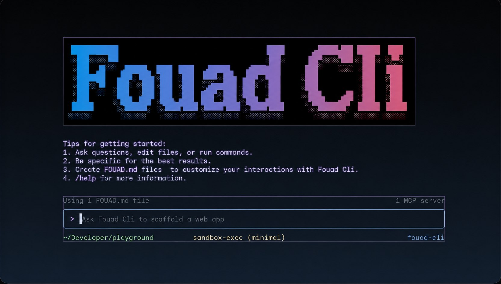
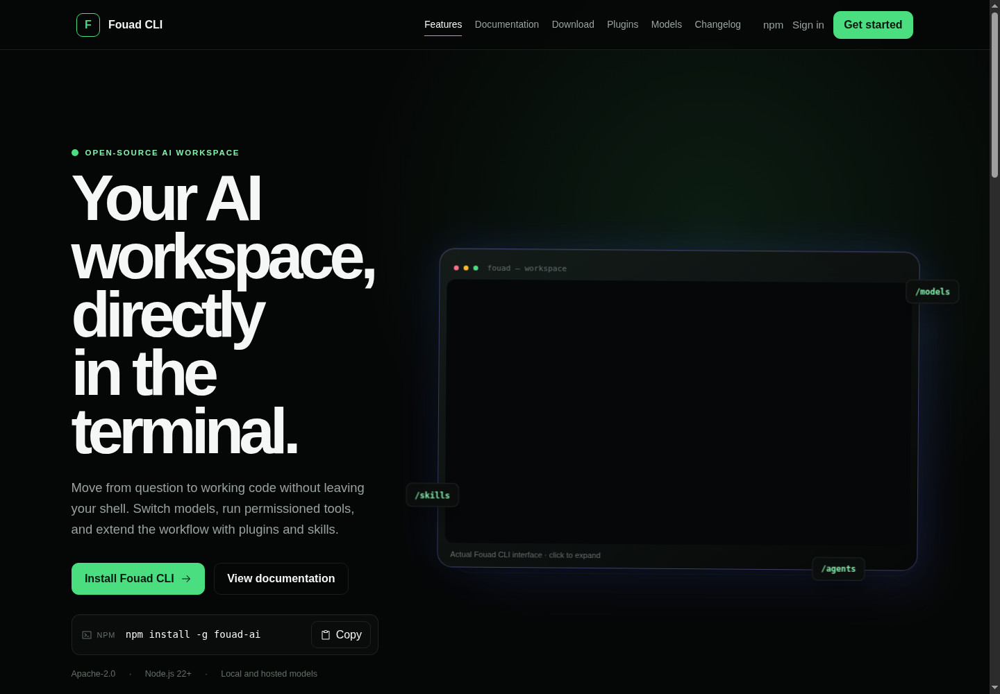
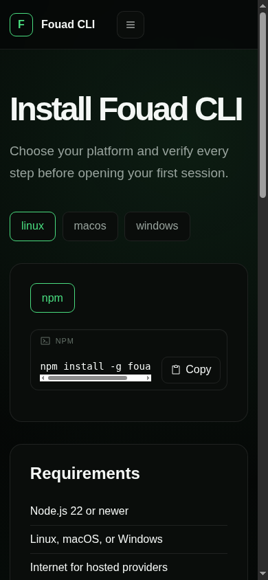
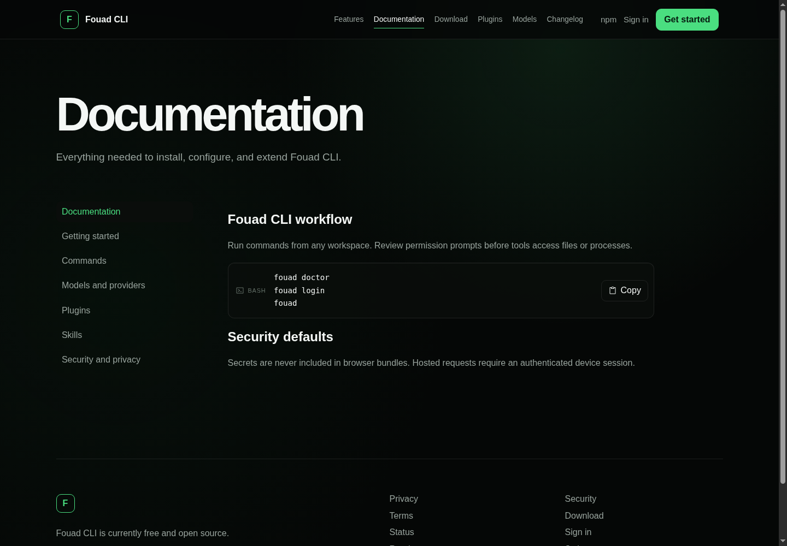
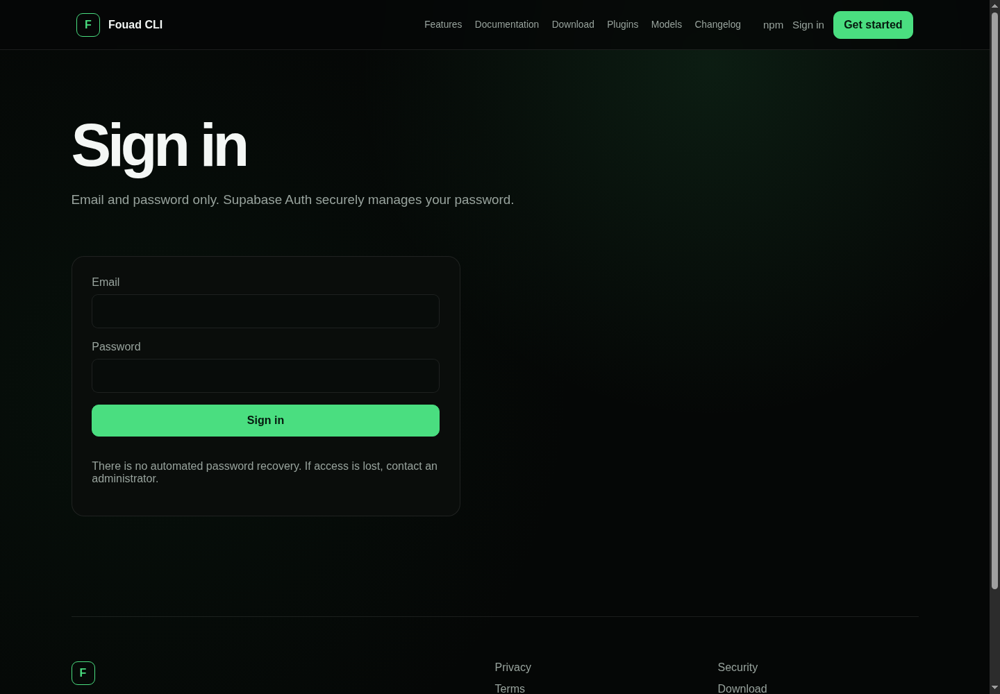

# Fouad CLI



[](LICENSE)
[](https://nodejs.org/)
[](https://fouad-cli-platform.fouadzulof26.workers.dev/)
[](https://www.npmjs.com/package/fouad-ai)

Fouad CLI is an open-source AI coding workspace for the terminal. It brings
model-assisted development, slash commands, local tools, plugins, skills, and
secure account linking into one focused command-line experience.

## Live platform

- **GitHub repository:** [github.com/fouadcyper/fouad-ai-cli](https://github.com/fouadcyper/fouad-ai-cli)
- **Website:** [fouad-cli-platform.fouadzulof26.workers.dev](https://fouad-cli-platform.fouadzulof26.workers.dev/)
- **Download:** [Installation guide](https://fouad-cli-platform.fouadzulof26.workers.dev/download)
- **Documentation:** [Fouad CLI Docs](https://fouad-cli-platform.fouadzulof26.workers.dev/docs)
- **Sign in:** [Account login](https://fouad-cli-platform.fouadzulof26.workers.dev/login)
- **Open source license:** [Apache-2.0](LICENSE)

## Interface preview

### Terminal interface


### Website homepage



### Download page



### Documentation



### Admin workspace



## Install

```bash
npm install -g fouad-ai
fouad --version
fouad
```

The global install makes the `fouad` command available from any project
directory. To connect a CLI device to the hosted account, run:

```bash
fouad login
fouad whoami
```

## Download from GitHub

Anyone can download the complete open-source project directly from GitHub:

```bash
git clone https://github.com/fouadcyper/fouad-ai-cli.git
cd fouad-ai-cli
npm install
npm run build
npm link
fouad --version
```

**Repository URL:**

```text
https://github.com/fouadcyper/fouad-ai-cli.git
```

You can also download a ZIP archive from the repository’s **Code → Download
ZIP** menu:

[Download Fouad CLI as ZIP](https://github.com/fouadcyper/fouad-ai-cli/archive/refs/heads/main.zip)

### Package and platform links

- **npm package:** [npmjs.com/package/fouad-ai](https://www.npmjs.com/package/fouad-ai)
- **Live website:** [fouad-cli-platform.fouadzulof26.workers.dev](https://fouad-cli-platform.fouadzulof26.workers.dev/)
- **Download page:** [Install Fouad CLI](https://fouad-cli-platform.fouadzulof26.workers.dev/download)
- **Account dashboard:** [Open dashboard](https://fouad-cli-platform.fouadzulof26.workers.dev/dashboard)
- **Admin dashboard:** [Open admin](https://fouad-cli-platform.fouadzulof26.workers.dev/admin)

## What is included

- Terminal-first AI coding workflow with streaming responses.
- Gemini, OpenAI-compatible, Ollama, llama.cpp, and explicit custom providers.
- Local model support with no silent cloud fallback.
- Slash commands, model selection, sessions, plugins, skills, and MCP tools.
- Workspace permissions, path-safety checks, secret redaction, and safe-mode.
- Browser-based CLI account linking with short-lived device authorization.
- Cloudflare Worker gateway and Supabase-backed account platform.
- Admin provider registry that stores secret references, never API key values.

## Development

```bash
git clone <your-fork-url>
cd fouad-ai-cli
npm install
npm run check
npm run platform:check
```

Build and preview the web platform locally:

```bash
npm run web:build
npm run web:preview
```

Deploy the existing Cloudflare Worker after configuring its secrets privately:

```bash
npm run platform:deploy:dry
npm run platform:deploy
```

Never commit API keys, Supabase service-role credentials, Wrangler tokens, or
model weights. See [SECURITY.md](SECURITY.md) before contributing.

## Project documentation

- [Architecture](docs/ARCHITECTURE.md)
- [AI provider management](docs/AI_PROVIDER_MANAGEMENT.md)
- [Cloudflare deployment](docs/CLOUDFLARE_SETUP.md)
- [Supabase setup](docs/SUPABASE_SETUP.md)
- [CLI authentication flow](docs/CLI_AUTH_FLOW.md)
- [Security model](docs/SECURITY_MODEL.md)
- [Plugins](docs/PLUGINS.md) · [Skills](docs/SKILLS.md) · [MCP](docs/MCP.md)
- [Contributing](CONTRIBUTING.md)

## Open source

Fouad CLI is currently released as open source under the Apache-2.0 license.
Contributions, bug reports, provider adapters, plugins, and documentation
improvements are welcome. Hosted provider limits and free-tier policies are
controlled by the selected provider and may change independently of this
project.

## License

Original Fouad CLI code is licensed under [Apache-2.0](LICENSE). Third-party
software and model licenses are listed in
[THIRD_PARTY_NOTICES.md](THIRD_PARTY_NOTICES.md) and
[MODEL_LICENSES.md](MODEL_LICENSES.md).

## Verification

The current local verification completes successfully with formatting, lint,
web and Worker type checks, production build, and the full Vitest suite,
including the pseudo-terminal flow for `/help`.

```text
15 test files passed · 46 tests passed
```

The project is ready to push to GitHub. A GitHub remote is intentionally not
configured in this checkout, so no repository was created or pushed
automatically. Add your own remote, then push the branch:

```bash
git remote add origin https://github.com/YOUR_ACCOUNT/fouad-ai-cli.git
git add .
git commit -m "docs: add GitHub project README and interface previews"
git push -u origin main
```
